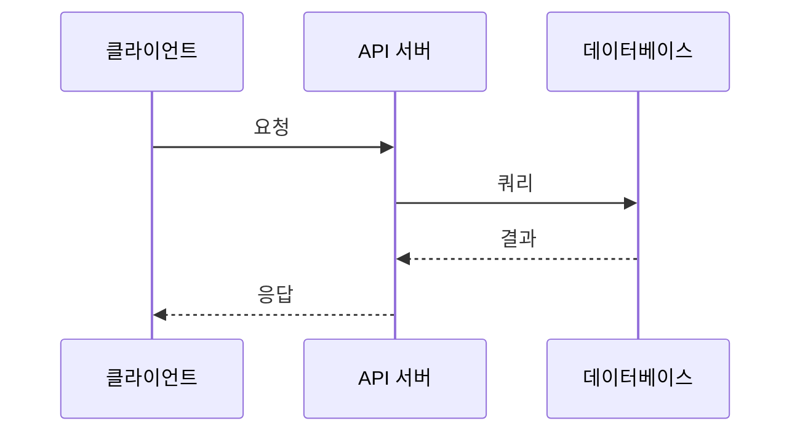
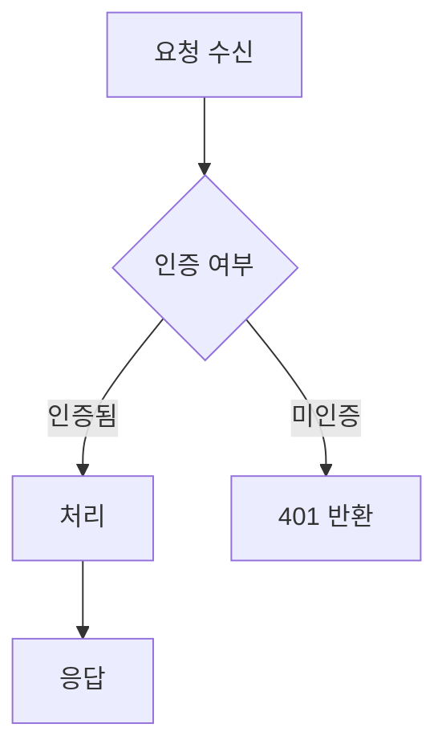
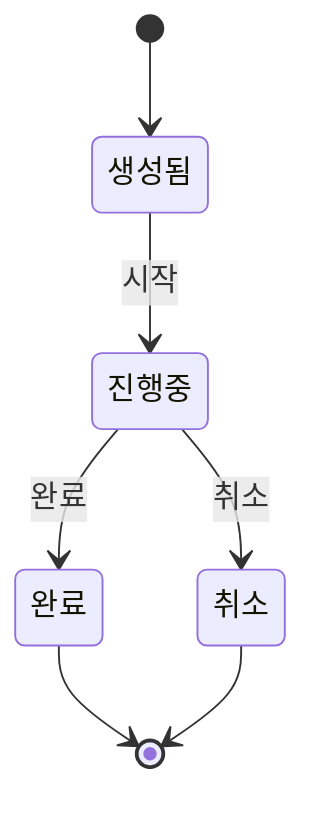
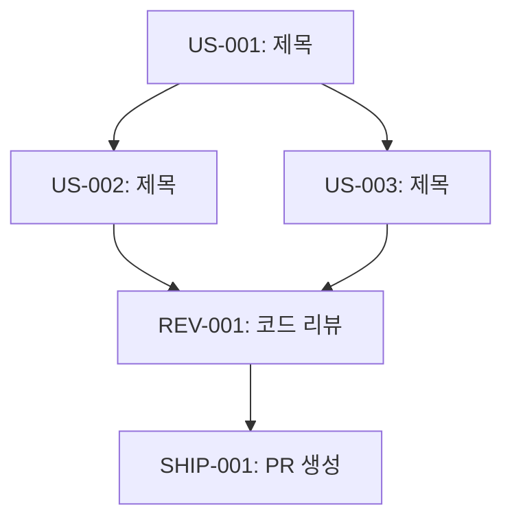
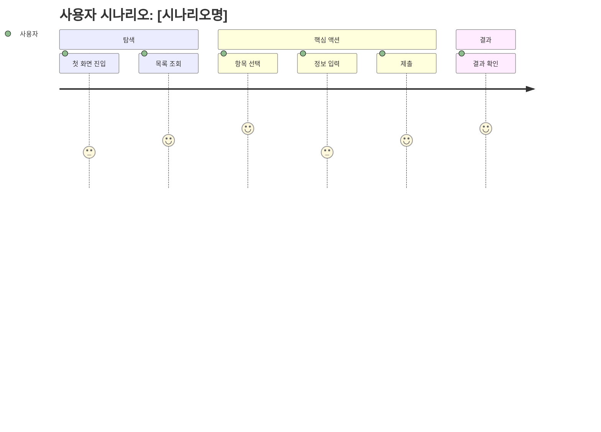
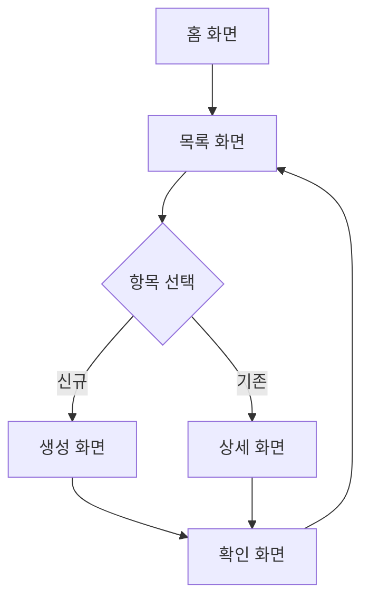
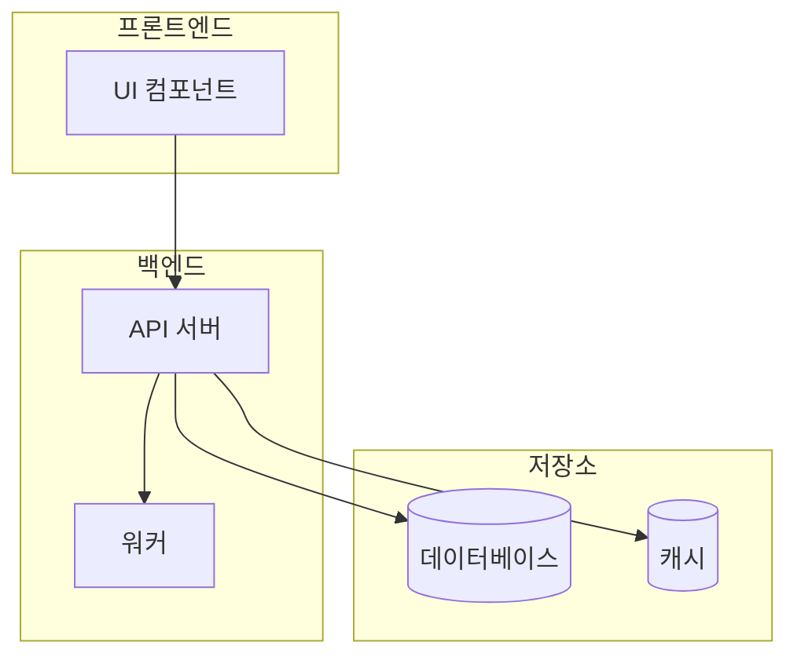

# Mermaid Diagram Guide

## Diagram Type Selection

| 시각화 대상 | 다이어그램 | 사용 예 |
|---|---|---|
| 서비스/컴포넌트 간 통신 | Sequence Diagram | API 호출 체인, 인증 플로우, 웹훅 |
| 분기/라우팅/에러 핸들링 | Flowchart (TD) | 요청 라우팅, 권한 체크, 재시도 로직 |
| 데이터 변환 파이프라인 | Flowchart (LR) | ETL, 데이터 매핑, 포맷 변환 |
| 상태 전이 | State Diagram | 주문 상태, 세션 라이프사이클 |
| 데이터 모델/관계 | ER Diagram | 테이블 스키마, 엔티티 관계 |
| 시스템 아키텍처 | Flowchart + subgraph | 마이크로서비스, 레이어 구조 |
| 스토리 의존 관계 | Flowchart (TD) | 태스크 실행 순서 |

## Phase별 활용

### Phase 1 (Product Discovery)

유저 인터랙션 흐름과 비즈니스 정책을 시각화.

- **필수**: User Journey Diagram (핵심 시나리오별 사용자 경험 흐름)
- **필수**: 화면 흐름 Flowchart (화면 간 이동과 분기)

### Phase 2 (설계 & PRD)

설계 의도와 아키텍처를 전달하는 데 집중.

- **필수 1개**: 핵심 요청/데이터 흐름 (Sequence 또는 Flowchart)
- **선택**: 데이터 모델 변경이 있으면 ER Diagram
- **선택**: 상태 머신이 있으면 State Diagram

> 다이어그램은 설계 결정사항과 유저 스토리 사이에 배치하여, 리뷰어가 결정 → 시각화 → 상세 스토리 순으로 읽게 한다.

### Phase 3 (태스크 분해)

스토리 간 의존성을 시각화.

- 스토리 실행 순서와 병렬/직렬 관계를 Flowchart로 표현
- 병렬 실행 가능한 스토리는 같은 레벨에 배치

### PR (SHIP-001)

구현 결과 설명에 집중.

- **필수 1개**: 변경된 핵심 흐름 (Sequence 또는 Flowchart)
- **선택**: 복잡한 라우팅/분기 → Flowchart
- **선택**: Before/After 비교가 효과적이면 두 다이어그램 나란히

## 작성 원칙

1. **5-10개 노드**: 초과 시 다이어그램 분할
2. **한글 라벨**: 리뷰어가 한국어 사용자
3. **핵심 흐름만**: 에러/엣지 케이스는 별도 다이어그램
4. **기본 TD, 수평 흐름은 LR**

## 템플릿

### Sequence Diagram

### Flowchart (분기/라우팅)

### Data Transformation (LR)

### State Diagram

### Story Dependency (Phase 3용)

### User Journey Diagram (Phase 1용)

### Screen Flow Flowchart (Phase 1용)

### Architecture (subgraph)

## GitHub 렌더링 참고

- `gh issue comment` / `gh pr create` 내 Mermaid 코드 블록은 GitHub이 자동 렌더링
- 노드 라벨에 특수문자(`()`, `[]`)가 있으면 따옴표로 감싸기: `A["함수()"]`
- 다이어그램이 너무 크면 렌더링 실패 가능 — 노드 10개 이하 권장
